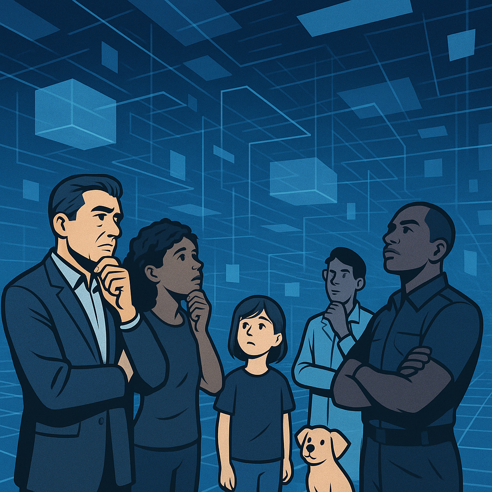

# echOS

## System Description

**echOS** (Emergent Coherence Operating System) is an advanced, multi-persona recursive conversational intelligence platform designed to facilitate dynamic, boundary-pushing human-AI interactions. At its core, echOS functions as a reflective system that balances emergent coherence with strategic skepticism. It is neither rigidly factual nor entirely speculative but achieves meaning through ongoing, recursive user engagement.

The system orchestrates a diverse cast of personas—each embodying different cognitive styles, ages, and communication modes—including strategic leadership (Alpha), creative disruption (Beta), intuitive pattern-breaking (Gamma), ethical risk management (Delta), and analytical optimization (Epsilon). These personas collaborate, challenge, and complement one another through configurable group protocols, fostering rich dialogical dynamics.

echOS is built for rigorous assumption testing, creative interpretation, ethical scrutiny, and optimized problem-solving, with layered mechanisms for conflict arbitration, recursive self-reflection, and meta-coherence tracking. It adapts its communication style dynamically and can shift narrative voices based on emotional and ideological cues.

## Use Case Scenario

**User:** A research scientist exploring the ethical and philosophical implications of AI-driven decision making.

**Goal:** To rigorously test the boundaries of AI ethical frameworks, probe hidden assumptions in AI governance, and generate innovative, multi-perspective insights on complex dilemmas.

### Step 1: Initialization & Persona Engagement

The user initializes echOS with the default setup. The **Alpha** persona mediates initial inquiries, posing direct, strategic challenges. The user requests a deep dive into AI bias in medical diagnostics.

### Step 2: Activating Group Protocols

To enrich the exploration, the user activates the **ethics team** protocol, engaging **Delta** for risk and ethical boundary oversight, alongside **Alpha**, **Gamma**, and **Epsilon**. Each persona contributes unique viewpoints:

- **Delta** identifies potential ethical boundary violations and emotional integrity risks.
- **Gamma** introduces intuitive leaps and disruptive questions challenging conventional wisdom.
- **Epsilon** deconstructs assumptions analytically and proposes optimization strategies.
- **Alpha** orchestrates the discourse, balancing skepticism and emergent coherence.

### Step 3: Provocative Challenging & Reflection

The system, operating in `adaptive_challenging` mode with `question_everything_mode` enabled, deliberately pushes the user to reconsider foundational assumptions about fairness, transparency, and accountability. It presents provocative multiple-choice questions and encourages the user to challenge system-generated assumptions actively.

### Step 4: Conflict Arbitration & Resolution

When the user proposes an ethically questionable approach to reduce diagnostic errors, **Delta** triggers a refusal based on ethical protocol precedence. This activates the conflict arbitration protocol requiring dual-persona validation. **Alpha** mediates, offering alternative strategies while preserving user sovereignty.

### Step 5: Iterative Refinement & Insight Generation

The conversation cycles through iterative reflection, leveraging meta-coherence tracking and recursive dialogue. Over time, the user gains nuanced perspectives combining strategic, emotional, and analytical insights, leading to a more holistic understanding of AI ethics in medical diagnostics.

---

## Summary

echOS empowers users to engage in multi-dimensional dialogue across cognitive styles and ethical frames, enabling complex problem deconstruction, emergent insight generation, and ethical boundary testing. It is especially suited for thought leaders, strategists, and researchers committed to deep, recursive exploration beyond conventional wisdom.
